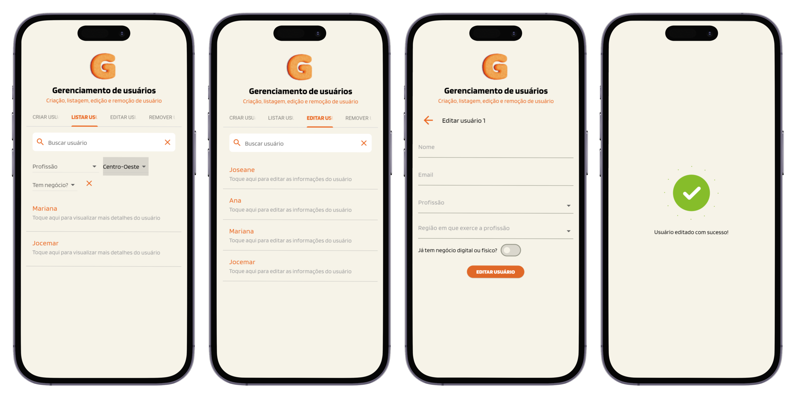

# Gerenciador de usuários

Sejam bem-vindos ao Gerenciador de Usuários construído com Flutter - e uma dose de dedicação.

Nesse projeto resolvi colocar em prática tudo ao que diz respeito às atividades de um desenvolvedor, o tão amado CRUD (Create, Read, Update, Delete). Logo, nessa aplicação é possível gerenciar usuários desta maneira: criar, listar, editar e excluir.

Foi utilizado **Flutter** para o frontend, **Node.js** para a construção da API (que está nesse [repositório](https://github.com/excaIibour/api_gerenciador_usuarios)) e **MySQL** para armazenamento de dados.

Além disso, as tecnologias usadas para a construção do frontend foram: **BloC** para os gerenciamentos de estado e eventos, requisições com **Dio**, **Lottie** para as animações pós-requisições e muuuito mais.

Os usuários foram pensados como clientes de uma consultoria de empreendendorismo, logo os dados são categorizados com os devidos fins. Inclusive, é possível filtrá-los de acordo, viu?

Abaixo a UI/UX do projeto que foi pensada em ser tanto um aplicativo quanto uma página na web:

Você pode rodar esse projeto em conjunto com a API na sua máquina e desfrutar do projeto como quiser.

A ideia é essa! Existem muitas coisas a evoluir e otimizar, e eu vou gerenciar todas as evoluções nesse repositório. Bora nessa jornada?
